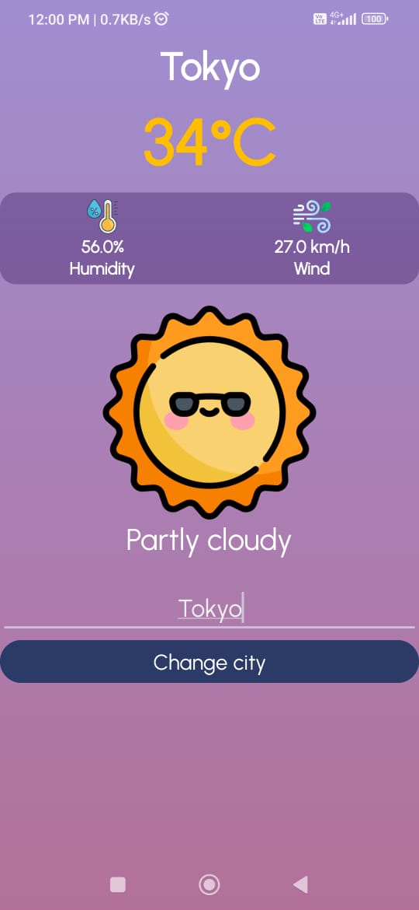

# WeatherApp 🌤️

A simple and elegant Weather App built with Android Studio to display real-time weather information for any location. This app fetches data from [WeatherAPI.com](https://www.weatherapi.com/) and presents it in a clean and user-friendly interface.

## 📱 Features

- 🌍 Search weather by city name.
- 📡 Real-time weather updates.
- 🌞 Displays temperature, weather condition, wind speed, humidity, etc.
- 🌓 Auto-updates day/night icons.
- 📍 (Optional) Detects current location and shows weather (with GPS permission).
- 🖼️ Beautiful weather icons from [WeatherAPI](https://www.weatherapi.com/docs/).

## 🔧 Tech Stack

- **Language**: Java
- **IDE**: Android Studio
- **API**: [WeatherAPI.com](https://www.weatherapi.com/)
- **UI**: XML Layouts with Material Design


## 🖼️ Screenshots
| Home Screen | Weather Info |
|-------------|--------------|
|  |

## 🚀 Getting Started

### Prerequisites
- Android Studio installed
- WeatherAPI.com API Key
- Internet connection

### Setup Instructions
1. Clone this repository:
   ```bash
   git clone https://github.com/YourUsername/WeatherApp.git
   ```
2. Open project in Android Studio.
3. Add your **WeatherAPI Key** in `Constants.java` or directly in the API call.
4. Run the project on emulator or device.

## 📦 API Reference

Weather Data is fetched from [WeatherAPI.com](https://www.weatherapi.com/).

Example API Request:
```
https://api.weatherapi.com/v1/current.json?key=YOUR_API_KEY&q=London
```

## 🛠️ Possible Improvements
- Add 5-day forecast feature.
- Add auto-location detection.
- Dark Mode support.
- Save recent searches.

## 🙌 Acknowledgements
- [WeatherAPI.com](https://www.weatherapi.com/) for providing free weather data.
- Open-source community and Android Developers documentation.

## 📄 License
This project is licensed under the MIT License - see the [LICENSE](LICENSE) file for details.

---
